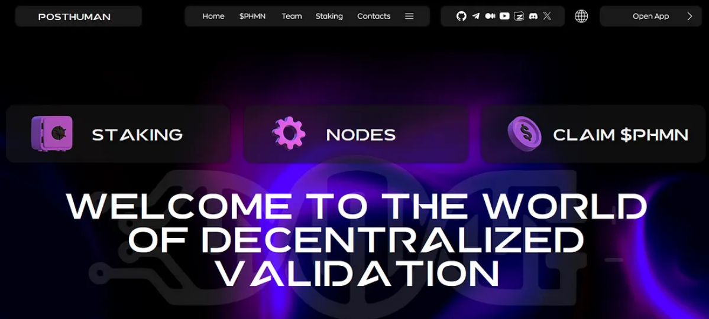
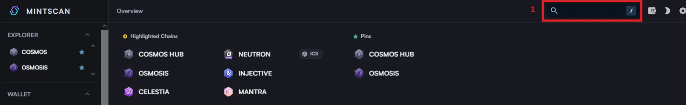
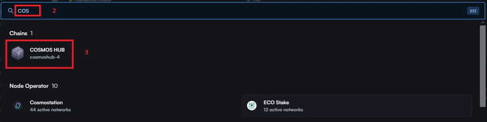
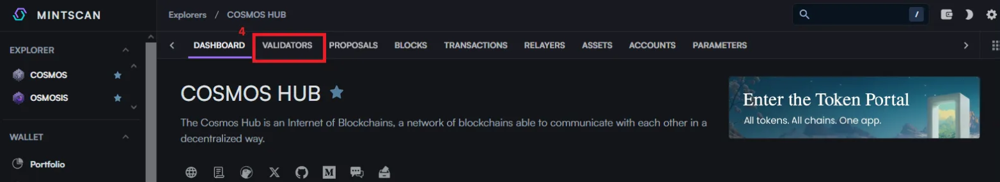
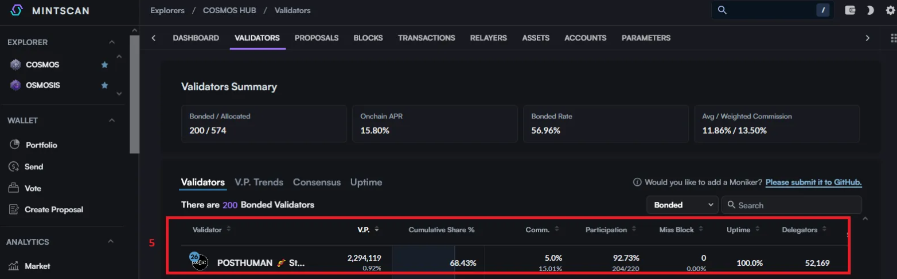
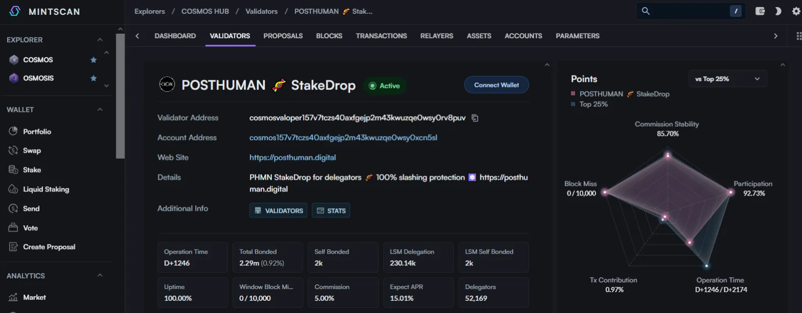

# Posthuman Validator: Децентрализованное будущее стейкинга

## Введение
[Posthuman Validator](https://posthuman.digital/) — это узел в экосистеме Cosmos, который обеспечивает безопасность сети и позволяет пользователям получать вознаграждения за стейкинг. Делегируя токены этому валидатору, вы поддерживаете децентрализацию и зарабатываете проценты на вложенные активы.
## Почему стоит выбрать Posthuman Validator?
- Надежность: Валидатор работает стабильно, обеспечивая бесперебойную работу сети.
- Прозрачность: Информация о ноде доступна на таких платформах, как [Mintscan](https://www.mintscan.io/).
- Поддержка сообщества: Разработчики активно взаимодействуют с пользователями и развивают проект.  
[posthumanchat](https://t.me/posthumanchat)  
[posthumannews](https://t.me/posthumannews)  
[Crypto_Base_Chat](https://t.me/Crypto_Base_Chat)
## Как проверить параметры валидатора
Можно воспользоваться Mintscan:
- В строке поиска выбираем интересующую нас сеть

- Для примера выберем COSMOS

- В открывшемся окне выбираем вкладку VALIDATORS

- Ищем интересующего нас валидатора, рассмотрим на примере POSTHUMAN

- Как правило, хорошими показателями для выбора валидатора считается:
  1. Commission — 5%
  2. Miss Block — 0
  3. Uptime — 100%
Как видим валидатор POSTHUMAN соответствует данным критериям

- Также можно рассмотреть показатели валидатора детальнее
## Как делегировать токены через Keplr

